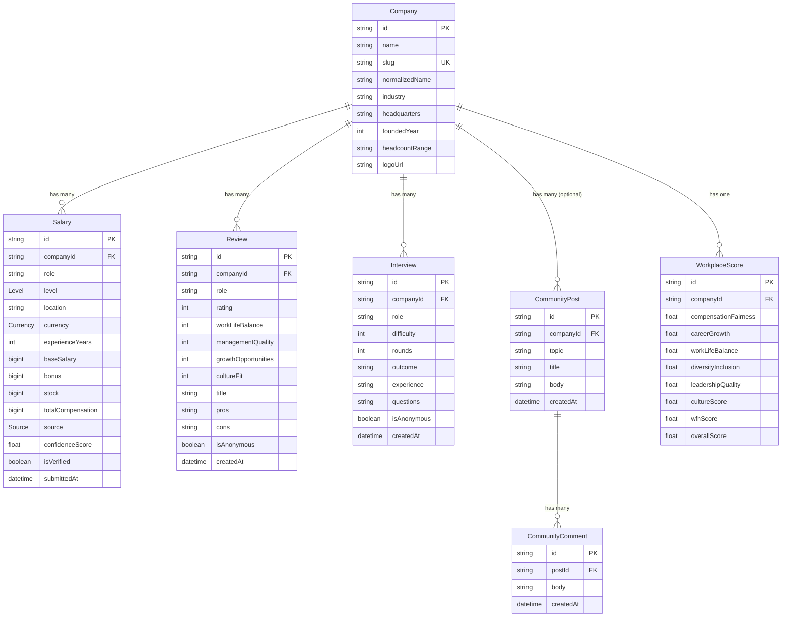
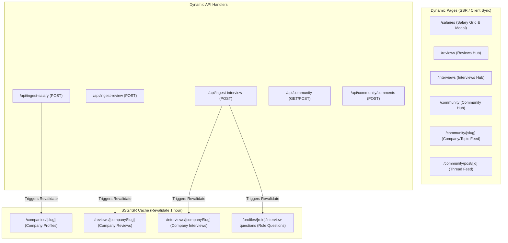

# TalentDash — Tech Compensation & Candidate Experience Platform

TalentDash is a career intelligence platform focused on tech compensation, employer reviews, and interview experiences. It converts crowdsourced and scraped data into decision-ready insights for tech careers in India and worldwide.

---

## 1. Project Goal & Design Philosophy

TalentDash is built as a programmatic SEO platform. It is designed to scale organic search traffic by dynamically generating highly structured company profile pages, side-by-side comparison tables, employer review breakdowns, and role-specific interview preparation pages.

- **Data-First**: Visual layouts maximize information density while remaining readable, clean, and professional.
- **Airbnb UI Discipline**: Strict spacing, typography, and contrast rules.
- **Light-Mode Only**: Avoids dark mode, glassmorphism, or heavy gradients. Design relies on raw data tables, border cards, and minimal accent highlights.

---

## 2. Non-Negotiable Technology Stack

- **Frontend**: Next.js 16 App Router, TypeScript (Strict Mode), Tailwind CSS v4, React Server Components (RSC)
- **Backend Services**: Next.js Route Handlers, service-oriented business logic layers
- **ORM / Database**: Prisma ORM v7, Neon Serverless PostgreSQL (with connection pooling)

---

## 3. System Architecture & Diagrams

### Database Entity Relationship Diagram (ERD)



### Rendering & Caching Flow (Next.js 16 App Router)



---

## 4. Design System Color Tokens

All design tokens are defined in `src/app/globals.css` using Tailwind v4 theme configurations:

| Token | Hex Code | Usage |
|---|---|---|
| `--color-primary` | `#FF5A5F` | Buttons, CTAs, active highlights, negative deltas |
| `--color-deep-text` | `#222222` | H1 headings, company titles, major metrics |
| `--color-body-text` | `#484848` | Body paragraphs, standard text |
| `--color-muted-text` | `#717171` | Helper labels, small timestamps, empty states |
| `--color-surface` | `#FFFFFF` | Cards, tables, popup modals |
| `--color-background-app` | `#F7F7F7` | Core application background |
| `--color-border-custom` | `#EBEBEB` | Dividers, input outlines, table rows |
| `--color-success` | `#008A05` | Growth indicators, positive delta win badges |
| `--color-warning` | `#FFB400` | Incomplete or unverified records |
| `--color-error` | `#D93025` | Form errors, negative deltas |
| `--color-hover-surface` | `#F2F2F2` | Table row hover highlight |

---

## 5. Platform Structure (Product Areas)

The platform currently implements 8 fully functional product areas:

1. **Salaries** (✅ Completed): Dynamic search, sorting, and pagination list at `/salaries`.
2. **Companies** (✅ Completed): SEO-optimized company profiles at `/companies/[slug]`.
3. **Compare** (✅ Completed): Interactive side-by-side analysis at `/compare`.
4. **Reviews** (✅ Completed): Anonymous employer reviews, rating metrics breakdown, and dynamic submission modal at `/reviews`.
5. **Interviews** (✅ Completed): Interview preparation dashboard with difficulty ratings, typical rounds counts, outcome rate statistics (offer/rejection/ghosted), questions asked, and dynamic submission modal at `/interviews`. Role-specific questions profiles under `/profiles/[role]/interview-questions`.
6. **Tools** (✅ Completed): Interactive career calculators (salary, hike, equity/ESOP) and side-by-side offer comparison tools at `/tools`.
7. **Community** (✅ Completed): Anonymous professional discussion forums featuring company boards, topic feeds, and comment threads at `/community`.
8. **Workplace Index** (✅ Completed): Composite Michelin-style rating and rankings dashboard for tech employers at `/workplace-index`.

---

## 6. Core Data Contracts

Every layer of the application (Prisma schema, TypeScript interfaces, validation middleware) enforces these strict schema contracts:

### Salary Record

```typescript
type SalaryRecord = {
  id: string;
  companyId: string;
  role: string;
  level: Level;
  location: string;
  currency: Currency;
  experienceYears: number;
  baseSalary: bigint;
  bonus: bigint;
  stock: bigint;
  totalCompensation: bigint;
  source: Source;
  confidenceScore: number;
  isVerified: boolean;
  submittedAt: Date;
};
```

### Review Record

```typescript
type ReviewRecord = {
  id: string;
  companyId: string;
  role: string | null;
  rating: number | null; // 1-5 (Overall)
  workLifeBalance: number | null; // 1-5
  managementQuality: number | null; // 1-5
  growthOpportunities: number | null; // 1-5
  cultureFit: number | null; // 1-5
  title: string | null;
  pros: string | null; // Min 20 characters
  cons: string | null; // Min 20 characters
  isAnonymous: boolean;
  createdAt: Date;
};
```

### Interview Record

```typescript
type InterviewRecord = {
  id: string;
  companyId: string;
  role: string | null;
  difficulty: number | null; // 1-5
  rounds: number | null; // 1-10
  outcome: string | null; // OFFER, REJECT, GHOSTED
  experience: string | null; // Min 20 characters
  questions: string | null; // Min 10 characters
  isAnonymous: boolean;
  createdAt: Date;
};
```

### Community Post Record

```typescript
type CommunityPostRecord = {
  id: string;
  companyId: string | null;
  topic: string | null;
  title: string;
  body: string;
  createdAt: Date;
};
```

### Community Comment Record

```typescript
type CommunityCommentRecord = {
  id: string;
  postId: string;
  body: string;
  createdAt: Date;
};
```

### Workplace Score Record

```typescript
type WorkplaceScoreRecord = {
  id: string;
  companyId: string;
  compensationFairness: number | null;
  careerGrowth: number | null;
  workLifeBalance: number | null;
  diversityInclusion: number | null;
  leadershipQuality: number | null;
  cultureScore: number | null;
  wfhScore: number | null;
  overallScore: number | null;
};
```

---

## 7. Rendering & Caching Strategy

To balance fast loading speeds (LCP < 2s) and database query costs, the platform utilizes Next.js App Router caching layers:

- **Homepage (`/`)**: Incremental Static Regeneration (ISR) with `revalidate = 3600` (1 hour) to keep employer counters fresh.
- **Salaries Page (`/salaries`)**: Dynamic server-side rendering combined with client-side query string synchronization to support infinite filter variations.
- **Reviews & Interviews Hubs**: Dynamic SSR with caching configured as `s-maxage=300, stale-while-revalidate=3600`.
- **Community Forums (`/community`, `/community/[slug]`, `/community/post/[id]`)**: Dynamic SSR routes (caching: `s-maxage=60, stale-while-revalidate=600`) for real-time discussion updates and thread replies.
- **Workplace Index (`/workplace-index`, `/workplace-index/rankings`)**: Static rendering with cache regeneration hourly (`revalidate = 3600`) for high performance.
- **Workplace Industry Indices (`/workplace-index/[industry]`)**: Static Site Generation (SSG) with path compilation via `generateStaticParams()` to optimize SEO indexing for target industries.
- **Company Specific Pages (`/companies/[slug]`, `/reviews/[companySlug]`, `/interviews/[companySlug]`)**: Static Site Generation (SSG) using `generateStaticParams()` to pre-render pages. Fallback is set to compile new companies dynamically. Purged and revalidated on cache paths whenever new data is ingested.

---

## 8. Setup and Local Development

### Prerequisites
- Node.js 18+
- Neon PostgreSQL Database

### Installation & Run

1. Clone and install dependencies:
   ```bash
   npm install
   ```
2. Populate your `.env` file in the root using Neon credentials:
   ```env
   DATABASE_URL="postgresql://[user]:[pass]@[endpoint]-pooler.region.aws.neon.tech/[dbname]?sslmode=require"
   DIRECT_URL="postgresql://[user]:[pass]@[endpoint].region.aws.neon.tech/[dbname]?sslmode=require"
   NEXT_PUBLIC_BASE_URL="http://localhost:3000"
   ```
3. Generate the Prisma Client:
   ```bash
   npx prisma generate
   ```
4. Push database tables and run the seed script:
   ```bash
   npm run db:push
   ```
   *Note: This command will automatically run the TypeScript seeding command to populate tech employers, salaries, reviews, interviews, community posts, and comments.*
5. Run the dev server:
   ```bash
   npm run dev
   ```

---

## 9. Scraper & Ingestion Pipeline

Ingestion endpoints are available at:
- `POST /api/ingest-salary`
- `POST /api/ingest-review`
- `POST /api/ingest-interview`

Each follows a strict validation pipeline:
1. **Validation**: Checks for mandatory fields, types, range constraints (difficulty 1-5, rounds 1-10, experience years 1-50), and character length (e.g. min 20 chars for experiences).
2. **Normalization**: Automatically normalizes company names (removes suffixes like "Ltd" or "Inc" and converts to lowercase) and generates SEO-friendly slugs.
3. **Total Compensation**: For salary ingest, server-side arithmetic adds base, bonus, and stock.
4. **Deduplication**: Rejects submissions with matching parameters submitted within the last 48 hours.

---

## 10. "With Another Day" (Future Scope)

If given another day of development, the following features would be implemented:
- **Secure Ingestion Tokens**: Add JWT-based API key authentication to API ingest routes to verify crawlers and prevent spam.
- **Rich Text / Code Editor**: Add Markdown rendering or syntax highlight supports inside community boards.
- **Search Auto-Suggestions**: Add full-text search capability that provides instant company auto-completions as users type.
- **Workplace Index Charts**: Fully connect reviews metrics to Workplace Indexes and render dynamic performance radar charts.

---

## 11. Intentionally Cut

To meet programmatic SEO efficiency:
- **Authentication**: No sign-in/sign-up forms. Submissions are anonymous but validation filters and deduplication parameters are aggressive to guarantee data cleanliness.
- **Complex Charts**: Avoided heavy charting libraries (e.g. Chart.js, Recharts) to maximize page loading speeds. Data is represented using pure Tailwind CSS utility bars.
- **Dark Mode**: Omitted prefers-color-scheme styles to enforce a clean, single visual palette.

---

## 👤 Author

Developed with 💻 & ☕ by **[Sami Khan (its-SamiKhan)](https://github.com/its-SamiKhan)**.

